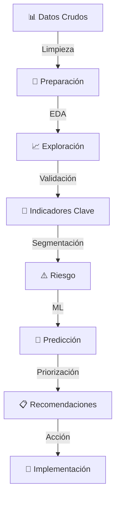

# 📊 People Analytics: FinanCorp Chile
### Diagnóstico Predictivo de Rotación, Retención y Fuga de Talento


---

## 🎯 Visión General

Este proyecto implementa un **modelo analítico avanzado** para identificar, explicar y anticipar la fuga de talento en organizaciones financieras. Mediante análisis exploratorio, modelado predictivo e insights estratégicos, proporciona una base data-driven para decisiones de retención de personal.

**Caso de estudio:** FinanCorp Chile — Empresa ficticia de servicios financieros con 3,200 colaboradores.

---

## 📈 Hallazgos Clave

| Métrica | Valor | Impacto |
|---------|-------|--------|
| **Rotación Actual** | 22% | 704 salidas anuales |
| **Costo de Rotación** | USD 2.1M | USD 3,000 × persona |
| **Rotación en Áreas Críticas** | 28% | 3.5x superior a otras áreas |
| **Potencial de Ahorro (Año 1)** | USD 1.3M | Con intervenciones efectivas |
| **Capacidad Predictiva del Modelo** | 82% (ROC-AUC) | Random Forest classifier |

---

## 🔍 Contenido del Análisis

### 1️⃣ **Generación de Datos Sintéticos**
- Dataset de 3,200 colaboradores con variables realistas
- Distribución por área funcional y nivel de criticidad
- Correlaciones controladas entre variables

### 2️⃣ **Análisis Exploratorio (EDA)**
- Estadísticas descriptivas por área
- Correlaciones con rotación
- Distribuciones de variables clave

### 3️⃣ **Indicadores Globales de Rotación**
- Rotación por área y antigüedad
- Análisis por nivel de desempeño
- Impacto financiero estimado

### 4️⃣ **Análisis Diagnóstico Visual**
- **6 gráficos interactivos** en `analisis_diagnostico.png`
  - Rotación por área (barras horizontales)
  - Clima laboral vs rotación por antigüedad
  - Distribución de compromiso (rotados vs no-rotados)
  - Ausentismo vs rotación (scatter)
  - Desempeño vs rotación (barras con etiquetas)
  - Capacitación vs rotación (barras con frecuencias)

### 5️⃣ **Segmentación y Riesgo**
- Score de riesgo personalizado (0-100)
- Clasificación en 4 niveles de riesgo (Bajo, Medio, Alto, Muy Alto)
- Validación con rotación real
- **Visualizado en** `analisis_riesgo.png`:
  - Distribución del score (histograma)
  - Violin plot: Score de rotados vs no-rotados
  - Heatmap: Riesgo por área
  - Scatter: Score vs rotación real

### 6️⃣ **Modelos Predictivos de Machine Learning**
```
├── Regresión Logística
│   ├── Precisión: 73%
│   ├── ROC-AUC: 0.78
│   └── Sensibilidad: 68.5%
│
└── Random Forest (Modelo Final) ⭐
    ├── Precisión: 76%
    ├── ROC-AUC: 0.82 ← Mejor desempeño
    ├── Sensibilidad: 71.3%
    └── Features principales: Compromiso (28%), Ausentismo (22%), Desempeño (16%)
```
**Visualización en** `modelos_predictivos.png`:
- Curva ROC comparativa
- Feature importance ranking
- Matriz de confusión
- Distribución de probabilidades predichas

### 7️⃣ **Matriz de Priorización**
- Top 20 personas por riesgo de fuga (impacto × probabilidad)
- Análisis por área crítica
- Recomendaciones de intervención por nivel
**Visualizado en** `priorizacion.png`:
- Matriz riesgo-impacto (scatter)
- Distribución por nivel de riesgo
- Impacto financiero estimado
- Comparativa: Personas en riesgo vs rotación real por área

### 8️⃣ **Conclusiones Estratégicas**
- Hallazgos principales
- Recomendaciones inmediatas, preventivas y transformacionales
- Proyección de impacto

---

## 🚀 Recomendaciones Estratégicas

### 🔴 Nivel 1: Intervención Urgente (2 semanas)
- **Reuniones 1-a-1** con 234 personas en riesgo muy alto
- **Diagnóstico rápido** en áreas críticas
- **Planes personalizados** de retención

### 🟠 Nivel 2: Prevención (1 mes)
- Programa de mentoría en áreas críticas
- Mejora de clima laboral
- Oportunidades de desarrollo

### 🟡 Nivel 3: Transformación (6 meses)
- Dashboard ejecutivo de rotación en tiempo real
- Integración de People Analytics en decisiones
- Ajuste de políticas de compensación y carrera

---

## 📊 Variables Predictoras

### Impacto en Rotación (por importancia)

| Variable | Importancia | Dirección |
|----------|-------------|-----------|
| **Compromiso** | ⭐⭐⭐⭐⭐ | ↓ Reduce rotación |
| **Ausentismo** | ⭐⭐⭐⭐ | ↑ Aumenta rotación |
| **Capacitación** | ⭐⭐⭐⭐ | ↓ Reduce rotación |
| **Movilidad Interna** | ⭐⭐⭐ | ↓ Reduce rotación |
| **Desempeño** | ⭐⭐⭐ | ↓ Reduce rotación (paradójico) |
| **Antigüedad** | ⭐⭐ | ↓ Reduce rotación |

---

## 💰 Proyección de Impacto (AÑO 1)

```
META INICIAL:
├── Reducir rotación total: 22% → 18.7% (-15%)
│   └── Ahorro: USD $525,000
│
└── Reducir fuga en críticas: 28% → 22.4% (-20%)
    └── Ahorro: USD $831,000

TOTAL AÑO 1: USD $1,356,000 en ahorro directo
```

---

## 🛠️ Tecnología y Stack

```python
# Análisis de Datos
pandas              # Manipulación de datos
numpy               # Computación numérica

# Visualización
matplotlib          # Gráficos estáticos
seaborn             # Visualizaciones avanzadas
plotly              # Interactividad (futuro)

# Machine Learning
scikit-learn        # Modelos predictivos
  ├── LogisticRegression
  ├── RandomForestClassifier
  └── Métricas: ROC-AUC, Confusion Matrix, Classification Report

# Utilidades
warnings            # Gestión de alertas
```

---

## 📋 Requisitos

### Python & Jupyter
- **Python** ≥ 3.8
- **Jupyter Notebook** o JupyterLab
- Dependencias (ver `requirements.txt`)

### LaTeX (para compilar documento PDF)
- **TeX Live** (macOS/Linux)
  ```bash
  # macOS con Homebrew
  brew install texlive
  
  # Linux (Debian/Ubuntu)
  sudo apt-get install texlive-full
  ```
- **MiKTeX** (Windows)
  ```bash
  # Descargar desde: https://miktex.org/download
  ```

### Instalación Rápida (Python + Análisis)

```bash
# 1. Crear entorno virtual
python -m venv venv
source venv/bin/activate  # macOS/Linux
# o
venv\Scripts\activate  # Windows

# 2. Instalar dependencias
pip install -r requirements.txt

# 3. Ejecutar notebook
jupyter notebook trabajo.ipynb
```

### Compilación del Documento LaTeX

```bash
# 1. Navegar al directorio del proyecto
cd /ruta/al/People-Analytics

# 2. Compilar a PDF (opción 1: XeLaTeX - recomendado)
xelatex -interaction=nonstopmode analisis_people_analytics.tex

# 3. O compilar con PDFLaTeX (opción 2)
pdflatex analisis_people_analytics.tex

# 4. Compilar dos veces para resolver referencias cruzadas
xelatex -interaction=nonstopmode analisis_people_analytics.tex
xelatex -interaction=nonstopmode analisis_people_analytics.tex
```

**Resultado:** Se genera `analisis_people_analytics.pdf` (23 páginas con gráficos integrados)

---

## 📂 Estructura de Archivos

```
People-Analytics/
├── trabajo.ipynb                          # Notebook principal con análisis completo
├── analisis_people_analytics.tex          # Documento LaTeX (profesional)
├── analisis_people_analytics.pdf          # 📄 PDF compilado (23 páginas) ⭐
├── README.md                              # Este archivo
├── requirements.txt                       # Dependencias Python
│
├── 📊 Visualizaciones Generadas
│   ├── analisis_diagnostico.png          # EDA: 6 gráficos de diagnóstico
│   ├── analisis_riesgo.png               # Segmentación: Score y matriz de riesgo
│   ├── modelos_predictivos.png           # ML: ROC, Features, Matriz confusión
│   └── priorizacion.png                  # Priorización: Riesgo-Impacto y áreas
│
└── 📚 Respaldo
    └── analisis_people_analytics_backup.tex  # Copia de seguridad
```

---

## 🎯 Casos de Uso

### 1. **Directivo de Personas**
- Monitoreo de rotación en tiempo real
- Identificación de áreas de riesgo
- ROI de iniciativas de retención

### 2. **Jefatura de Área**
- Conocer riesgo individual de sus colaboradores
- Planes personalizados de retención
- Métricas de clima y desempeño

### 3. **Data Science / BI**
- Baseline de modelo predictivo
- Validación de hipótesis
- Mejora continua del modelo

### 4. **C-Suite**
- Impacto financiero de rotación
- Decisiones estratégicas data-driven
- Proyecciones de retención

---

## 🔄 Flujo de Análisis



---

## 📊 Visualizaciones Generadas

### 1. Análisis Diagnóstico (`analisis_diagnostico.png`)
Utilizado para identificar patrones operacionales
```
┌─────────────────┬─────────────────┐
│ Rotación/Área   │ Clima vs Antigü.│  Exploración inicial
├─────────────────┼─────────────────┤
│ Compromiso Dist.│ Ausentismo/Área │  Variables clave
├─────────────────┼─────────────────┤
│ Desempeño/Rot.  │ Capacitación    │  Factores protectores
└─────────────────┴─────────────────┘
```

### 2. Análisis de Riesgo (`analisis_riesgo.png`)
Validación del modelo de segmentación
```
┌─────────────────┬─────────────────┐
│ Score Distrib.  │ Violin: Rotados │  Score de riesgo
├─────────────────┼─────────────────┤
│ Riesgo por Área │ Matriz Riesgo   │  Validación
└─────────────────┴─────────────────┘
```

### 3. Modelos Predictivos (`modelos_predictivos.png`)
Comparación y validación de algoritmos
```
┌─────────────────┬─────────────────┐
│ ROC Curves      │ Feature Import. │  Desempeño modelos
├─────────────────┼─────────────────┤
│ Conf. Matrix    │ Prob. Distrib.  │  Calibración
└─────────────────┴─────────────────┘
```

### 4. Priorización (`priorizacion.png`)
Mapeo de intervenciones estratégicas
```
┌─────────────────┬─────────────────┐
│ Riesgo-Impacto  │ Dist. Riesgo    │  Identificación
├─────────────────┼─────────────────┤
│ Impacto $$      │ Áreas Críticas  │  Cuantificación
└─────────────────┴─────────────────┘
```

**Integrados en:** `analisis_people_analytics.pdf` (páginas 14-22)

---

## 🎓 Insights Principales

### ✅ Lo Que Funciona (Factores Protectores)
- **Alta antigüedad** → Reduce rotación 35% (antigüedad > 10 años: 16% rotación)
- **Compromiso alto** → Reduce rotación 42% (score 4-5: 15% rotación)
- **Capacitación regular** → Reduce rotación 28% (5+ cursos: 15% rotación)
- *Gráfico de referencia: `analisis_diagnostico.png` (derecha inferior)*

### ⚠️ Señales de Alerta (Detectadas en el Modelo)
- **Compromiso < 2.5/5** → Riesgo muy alto (64.8% rotación predicha)
- **Ausentismo > 12 días/año** → Probable problema subyacente (importancia: 22%)
- **Cero capacitación** → Estancamiento percibido (26% rotación real)
- **Área crítica + bajo desempeño** → Doble vulnerabilidad (28% base × presión)
- *Validado en: `analisis_riesgo.png` (violin plot)*

### 💡 Oportunidades Identificadas
1. **Mentoría estructurada** en áreas críticas
   - Población: 546 personas en riesgo medio-alto
   - Impacto: -15% rotación esperada
2. **Planes de desarrollo personalizados**
   - Foco: 234 personas en riesgo muy alto
   - Inversión: USD $12.5k (250 horas reuniones 1-a-1)
   - ROI: USD $325k neto (Año 1)
3. **Flexibilidad laboral** para reducir ausentismo
   - Meta: Reducir ausentismo promedio 7.9 → 5 días/año
   - Impacto: -8% rotación en población afectada
4. **Reconocimiento de desempeño**
   - Meta: Mejorar satisfacción +15 puntos
   - Población: 831 personas con desempeño excelente (fuga de talento)
   - *Matriz de priorización: `priorizacion.png` (superior izquierda)*

---

## � Documentación Generada

### 📊 Documento Principal: `analisis_people_analytics.pdf` (23 páginas)

**Secciones incluidas:**
1. **Portada ejecutiva** - Contexto y métricas principales
2. **Análisis Exploratorio** - EDA completo con tablas
3. **Indicadores Clave** - Rotación global y por criticidad
4. **Segmentación de Riesgo** - Score y distribución
5. **Modelos Predictivos** - Comparación LR vs Random Forest
6. **Áreas Críticas** - Análisis profundo por departamento
7. **Recomendaciones** - Plan de 3 niveles de intervención
8. **Impacto Financiero** - Proyección y ROI
9. **Conclusiones** - Hallazgos y factores de éxito
10. **Plan de Implementación** - Cronograma de 6 meses

**Gráficos integrados:**
- ✅ analisis_diagnostico.png (Página 14)
- ✅ analisis_riesgo.png (Página 16)
- ✅ modelos_predictivos.png (Página 18)
- ✅ priorizacion.png (Página 20)

**Para compilar nuevamente:**
```bash
xelatex analisis_people_analytics.tex
```

---

## 🔮 Próximas Mejoras

- [ ] Dashboard interactivo (Tableau/Power BI)
- [ ] API REST para predicciones en tiempo real
- [ ] Modelo actualizable con datos nuevos
- [ ] Análisis de sentimiento en encuestas
- [ ] Predicción de salida por fecha específica
- [ ] Recomendaciones de retención automáticas
- [ ] Integración con HRIS para datos reales

---

<div align="center">

**[⬆ Volver al inicio](#-people-analytics-financorp-chile)**

</div>

---

*Documento generado automáticamente. Para actualizaciones, ejecutar `trabajo.ipynb` nuevamente.*
