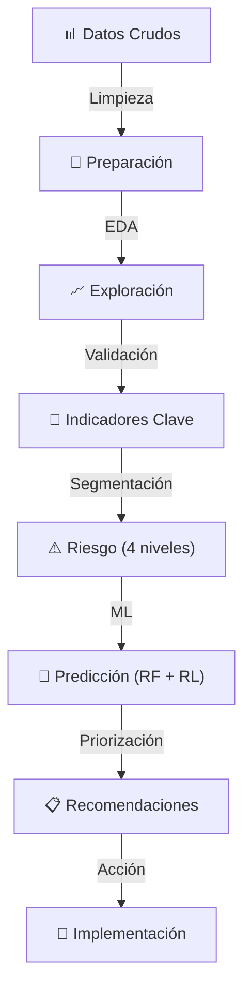

# 📊 People Analytics: FinanCorp Chile
### Diagnóstico Predictivo de Rotación, Retención y Fuga de Talento


---

## 🎯 Visión General

Este proyecto implementa un **modelo analítico avanzado** para identificar, explicar y anticipar la fuga de talento en organizaciones financieras. Mediante análisis exploratorio, modelado predictivo e insights estratégicos, proporciona una base data-driven para decisiones de retención de personal.

**Caso de estudio:** FinanCorp Chile — Empresa ficticia de servicios financieros con 3.200 colaboradores.

---

## 📈 Hallazgos Clave

| Métrica | Valor | Impacto |
|---------|-------|--------|
| **Rotación Actual** | 22.0% | 703 salidas anuales |
| **Costo de Rotación** | USD $2.109M | USD $3.000 × persona |
| **Rotación en Áreas Críticas** | 25.2% | **6.7×** superior a otras áreas (3.8%) |
| **Potencial de Ahorro (Año 1)** | USD $1.671M | Con intervenciones efectivas |
| **Capacidad Predictiva (RF)** | AUC 0.659 | Random Forest classifier |
| **Capacidad Predictiva (RL)** | AUC 0.677 | Regresión Logística |

---

## 🔍 Contenido del Análisis

### 1️⃣ **Generación de Datos Sintéticos**
- Dataset de 3.200 colaboradores con variables realistas
- Distribución por área funcional y nivel de criticidad
- Correlaciones controladas entre variables

### 2️⃣ **Análisis Exploratorio (EDA)**
- Estadísticas descriptivas por área
- Correlaciones con rotación
- Distribuciones de variables clave

### 3️⃣ **Indicadores Globales de Rotación**
- Rotación por área y antigüedad
- Análisis por nivel de desempeño
- Impacto financiero estimado

### 4️⃣ **Análisis Diagnóstico Visual**
- **6 gráficos interactivos** en `analisis_diagnostico.png`
  - Rotación por área (barras horizontales)
  - Clima laboral vs rotación por antigüedad
  - Distribución de compromiso (rotados vs no-rotados)
  - Ausentismo vs rotación (scatter)
  - Desempeño vs rotación (barras con etiquetas)
  - Capacitación vs rotación (barras con frecuencias)

### 5️⃣ **Segmentación y Riesgo**
- Score de riesgo personalizado (0-100)
- Clasificación en 4 niveles de riesgo:

| Nivel | N | % | Rotación Real |
|-------|---|---|---------------|
| Bajo (0–25) | 724 | 22.6% | 16.9% |
| Medio (25–50) | 1.385 | 43.3% | 21.1% |
| Alto (50–75) | 966 | 30.2% | 27.1% |
| Muy Alto (75+) | 79 | 2.5% | **30.4%** |

- **Visualizado en** `analisis_riesgo.png`

### 6️⃣ **Modelos Predictivos de Machine Learning**
```
├── Regresión Logística
│   ├── Precisión: 78.1%
│   └── ROC-AUC: 0.677
│
└── Random Forest
    ├── Precisión: 78.0%
    ├── ROC-AUC: 0.659
    ├── VN=499 / FP=0 / FN=141 / VP=0
    └── Features principales (importancia):
        ├── Antigüedad:      19.78%
        ├── Clima:           15.48%
        ├── Desempeño:       15.19%
        ├── Ausentismo:      14.44%
        ├── Compromiso:      14.39%
        ├── Área Crítica:    12.14%
        ├── Capacitación:     7.16%
        └── Movilidad:        1.42%
```
**Visualización en** `modelos_predictivos.png`

### 7️⃣ **Matriz de Priorización**
- Top personas por riesgo de fuga (impacto × probabilidad)
- Análisis por área crítica
- Recomendaciones de intervención por nivel

### 8️⃣ **Conclusiones Estratégicas**
- Hallazgos principales
- Recomendaciones inmediatas, preventivas y transformacionales
- Proyección de impacto financiero

---

## 🚀 Recomendaciones Estratégicas

### 🔴 Nivel 1: Intervención Urgente (2 semanas)
- **Reuniones 1-a-1** con **79 personas** en riesgo muy alto (tasa real 30.4%)
- **Diagnóstico rápido** de clima en áreas críticas
- **Análisis de brecha salarial** vs. mercado
- **Inversión:** USD $3.950 (79 horas)

### 🟠 Nivel 2: Prevención (1 mes)
- **Mentoría estructurada** para **966 personas** en riesgo alto
- Plan de capacitación: meta 3+ cursos/año
- Talleres de liderazgo para jefaturas
- **Inversión:** USD $205.000

### 🟡 Nivel 3: Transformación (6 meses)
- Dashboard ejecutivo de rotación en tiempo real
- Integración de People Analytics en decisiones de HR
- Revisión de políticas de carrera y compensación
- **Inversión:** USD $45.000

---

## 📊 Variables Predictoras

### Importancia en el Modelo Random Forest

| Variable | Importancia | Dirección |
|----------|-------------|-----------|
| **Antigüedad** | 19.78% | ↓ Reduce rotación |
| **Clima Laboral** | 15.48% | ↓ Reduce rotación |
| **Desempeño** | 15.19% | ↓ Reduce rotación |
| **Ausentismo** | 14.44% | ↑ Aumenta rotación |
| **Compromiso** | 14.39% | ↓ Reduce rotación |
| **Área Crítica** | 12.14% | ↑ Aumenta rotación |
| **Capacitación** | 7.16% | ↓ Reduce rotación |
| **Movilidad Interna** | 1.42% | ↓ Reduce rotación |

> **Correlación más fuerte:** Área Crítica (+0.185), Ausentismo (+0.153), Compromiso (-0.141)

---

## 💰 Proyección de Impacto (AÑO 1)

```
LÍNEA BASE:
├── Salidas anuales: 703
└── Costo total:     USD $2.109.000

ESCENARIO MODERADO (-15% rotación):
└── Ahorro estimado: USD $316.350

ESCENARIO OPTIMISTA (-20% rotación):
└── Ahorro estimado: USD $411.000

ROI POTENCIAL AÑO 1: USD $1.671.000
(considerando reducción en áreas críticas + retención talento clave)
```

---

## 🛠️ Tecnología y Stack

```python
# Análisis de Datos
pandas              # Manipulación de datos
numpy               # Computación numérica

# Visualización
matplotlib          # Gráficos estáticos
seaborn             # Visualizaciones avanzadas

# Machine Learning
scikit-learn        # Modelos predictivos
  ├── LogisticRegression
  ├── RandomForestClassifier
  └── Métricas: ROC-AUC, Confusion Matrix, Classification Report

# Utilidades
warnings            # Gestión de alertas
```

---

## 📋 Requisitos

### Python & Jupyter
- **Python** ≥ 3.8
- **Jupyter Notebook** o JupyterLab

### LaTeX (para compilar documentos PDF)
- **TeX Live** (macOS/Linux)
  ```bash
  # macOS con Homebrew
  brew install texlive

  # Linux (Debian/Ubuntu)
  sudo apt-get install texlive-full
  ```
- **MiKTeX** (Windows): https://miktex.org/download

### Instalación Rápida

```bash
# 1. Crear entorno virtual
python -m venv venv
source venv/bin/activate   # macOS/Linux
venv\Scripts\activate      # Windows

# 2. Instalar dependencias
pip install pandas numpy matplotlib seaborn scikit-learn jupyter

# 3. Ejecutar notebook
jupyter notebook trabajo.ipynb
```

### Compilación LaTeX

```bash
cd /ruta/al/People-Analytics

# Informe técnico (23 páginas)
pdflatex -interaction=nonstopmode analisis_people_analytics.tex

# Presentación ejecutiva (19 láminas)
pdflatex -interaction=nonstopmode presentacion_people_analytics.tex
```

---

## 📂 Estructura de Archivos

```
People-Analytics/
├── trabajo.ipynb                             # Notebook principal con análisis completo
│
├── 📄 Documentos LaTeX
│   ├── analisis_people_analytics.tex         # Informe técnico (23 páginas)
│   ├── analisis_people_analytics.pdf         # PDF compilado ⭐
│   ├── presentacion_people_analytics.tex     # Presentación Beamer (19 láminas)
│   ├── presentacion_people_analytics.pdf     # PDF compilado ⭐
│   └── analisis_people_analytics_backup.tex  # Copia de seguridad
│
├── 📊 Visualizaciones Generadas
│   ├── analisis_diagnostico.png              # EDA: 6 gráficos de diagnóstico
│   ├── analisis_riesgo.png                   # Segmentación: Score y matriz de riesgo
│   ├── modelos_predictivos.png               # ML: ROC, Features, Matriz confusión
│   └── priorizacion.png                      # Priorización: Riesgo-Impacto y áreas
│
└── README.md                                 # Este archivo
```

---

## 🎯 Casos de Uso

### 1. **Directivo de Personas**
- Monitoreo de rotación y costos en tiempo real
- Identificación de áreas de riesgo (Tecnología 35.6%, Atención Cli. 34.7%)
- ROI de iniciativas de retención (hasta $1.671M Año 1)

### 2. **Jefatura de Área**
- Conocer el perfil de riesgo de su equipo
- Planes personalizados de retención
- Métricas de clima, antigüedad y desempeño

### 3. **Data Science / BI**
- Baseline de modelo predictivo (AUC 0.659–0.677)
- Validación de hipótesis con datos sintéticos realistas
- Mejora continua del modelo

### 4. **C-Suite**
- Impacto financiero de la rotación (USD $2.109M/año)
- Decisiones estratégicas data-driven
- Proyecciones de retención con 3 escenarios

---

## 🔄 Flujo de Análisis



---

## 🎓 Insights Principales

### ✅ Factores Protectores
- **Alta antigüedad** → Principal predictor (19.78% importancia)
- **Buen clima laboral** → Segundo predictor (15.48%)
- **Desempeño alto** → Reduce rotación (15.19%)
- **Capacitación regular** → 7.16% importancia, 5+ cursos ↓ rotación

### ⚠️ Señales de Alerta
- **Área Crítica** → Correlación más fuerte con rotación (+0.185)
- **Ausentismo alto** → +0.153 de correlación (14.44% importancia en RF)
- **32.7% de la plantilla** (1.045 personas) en zona de riesgo alto/muy alto
- **79 colaboradores** (Muy Alto Riesgo) presentan 30.4% de rotación real

### 💡 Oportunidades de Intervención
1. **Acción urgente:** 79 personas Riesgo Muy Alto — USD $3.950 inversión, alto impacto
2. **Mentoría preventiva:** 966 personas Riesgo Alto — reducir umbral de salida
3. **Mejora de clima:** Principal variable modificable (15.48% importancia)
4. **Planes de carrera:** Reducir estancamiento en áreas críticas (Tecnología, Operaciones)

---

## 📚 Documentos Generados

### `analisis_people_analytics.pdf` — Informe Técnico (23 páginas)
Secciones: Portada · EDA · Indicadores · Segmentación · Modelos ML · Áreas Críticas · Recomendaciones · Impacto Financiero · Conclusiones · Plan de Implementación

### `presentacion_people_analytics.pdf` — Presentación Ejecutiva (19 láminas)
Beamer 16:9, tema Madrid. Incluye gráficos PGFPlots embebidos, tablas de datos y plan de intervención de 3 niveles.

---

## 🔮 Próximas Mejoras

- [ ] Dashboard interactivo (Tableau/Power BI)
- [ ] API REST para predicciones en tiempo real
- [ ] Modelo actualizable con datos reales via HRIS
- [ ] Análisis de sentimiento en encuestas de clima
- [ ] Predicción de fecha estimada de salida
- [ ] Recomendaciones de retención automáticas por perfil

---

<div align="center">

**Última actualización:** Mayo 2026 · **Versión:** 2.0

**[⬆ Volver al inicio](#-people-analytics-financorp-chile)**

</div>


---

